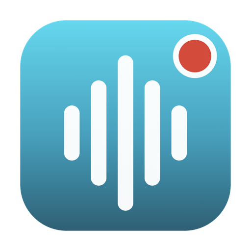
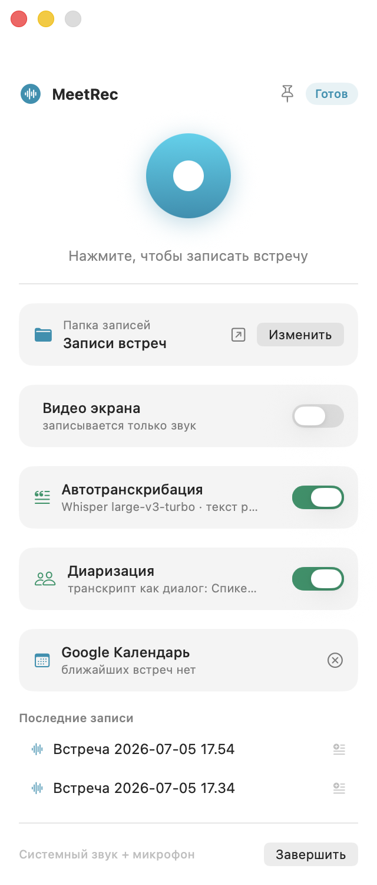

<div align="center">



# MeetRec

**Запись встреч на macOS — системный звук и микрофон в одном файле, с полностью локальной транскрибацией.**

[](https://github.com/chuck-uz/MeetRec/releases/latest)
[](#требования)
[](#требования)
[](LICENSE)

[English version](README.en.md)



</div>

## Зачем

Каждый сервис встреч записывает только сам себя. MeetRec записывает **любую** встречу — Zoom, Google Meet, Teams, звонок в браузере — потому что захватывает системный звук Mac вместе с вашим микрофоном и сводит их в один `.m4a`. Когда встреча заканчивается, рядом с записью появляется текстовая расшифровка с таймкодами. Всё происходит **на вашем Mac**: без серверов, подписок и отправки данных куда-либо.

## Возможности

- **Запись в один клик** — большая красная кнопка в компактном окне или прямо из строки меню; во время записи рядом с часами тикает таймер.
- **Системный звук + микрофон** записываются одновременно через ScreenCaptureKit и сводятся в один стереофайл AAC (48 кГц).
- **Локальная транскрибация** — [whisper.cpp](https://github.com/ggml-org/whisper.cpp) с моделью `large-v3-turbo`, ускорение на Metal. Час аудио — примерно 4–6 минут в фоне. Язык определяется автоматически (русский, английский и ещё 90+).
- **Markdown-расшифровки с таймкодами** (`[03:12] …`) рядом с каждой записью — готовы для вставки в любую LLM.
- **Самообновляющаяся модель** — приложение раз в сутки сверяется с [`models.json`](models.json) и само скачивает новую рекомендованную модель Whisper.
- **Дружит с Google Диском** — если установлен Google Drive для рабочего стола, записи попадают в *Мой диск → Записи встреч* и автоматически синхронизируются.
- **Интеграция с Google Календарём** — автоназвание записей по текущей встрече, участники в шапке транскрипта, уведомление «Встреча началась» с кнопкой «Записать». См. [настройку ниже](#google-календарь-опционально).
- **Видео экрана (опционально)** — тумблер в окне: вместе со звуком пишется весь экран в 30 к/с (HEVC, аппаратное кодирование, ~0,7–1,5 ГБ/час). Рядом с аудио появляется `.mp4` с тем же сведённым звуком; размер файла виден прямо во время записи.
- **Не мешает работать** — перетаскиваемое окно с булавкой «поверх всех окон», быстрые действия в строке меню.

## Установка

1. Скачайте `MeetRec.dmg` из [последнего релиза](https://github.com/chuck-uz/MeetRec/releases/latest).
2. Откройте образ и перетащите **MeetRec** в **Applications**.
3. Первый запуск: правый клик → **Открыть** (приложение подписано ad-hoc, Gatekeeper спросит один раз).
4. При первой записи выдайте два разрешения в *Системные настройки → Конфиденциальность и безопасность*:
   - **Запись экрана и системного звука** — для звука встречи;
   - **Микрофон** — для вашего голоса.

Модель Whisper (~1,6 ГБ) скачается автоматически перед первой транскрибацией, прогресс виден в приложении.

## Google Календарь (опционально)

Если подключить календарь, MeetRec:

- называет записи по текущей встрече — «Синк по платформе — 2026-07-05 15.00.m4a» вместо безликой даты;
- добавляет в шапку транскрипта название встречи, время и участников;
- показывает ближайшую встречу в окне;
- присылает уведомление в момент начала встречи с кнопкой «Записать».

Доступ — только на чтение (`calendar.readonly`), токены хранятся в Keychain macOS и не покидают ваш компьютер.

> **⏳ Статус: приложение проходит верификацию Google.** Пока она не завершена,
> готовые OAuth-реквизиты в сборку не входят — каждому пользователю нужен свой
> (бесплатный) OAuth-клиент. Это 10 минут:
>
> 1. Создайте проект в [Google Cloud Console](https://console.cloud.google.com), включите **Google Calendar API**.
> 2. Настройте OAuth consent screen (тип External) и опубликуйте его **In production**.
> 3. Создайте OAuth-клиент типа **Desktop app**.
> 4. Скопируйте [google_oauth.example.json](google_oauth.example.json) в
>    `~/Library/Application Support/MeetRec/google_oauth.json` и впишите свои `client_id` и `client_secret`.
> 5. В окне MeetRec нажмите **«Подключить»** в карточке календаря; на предупреждении
>    «Google hasn't verified this app» выберите *Advanced → Continue* (это ваше собственное приложение).
>
> После верификации календарь заработает «из коробки», без этих шагов.

## Требования

- macOS 15 Sequoia или новее
- Apple Silicon (собрано и проверено на M-серии)

## Использование

| Действие | Как |
|---|---|
| Начать / остановить запись | Большая кнопка или значок в строке меню → *Начать запись* |
| Следить за временем записи | Таймер в строке меню рядом со значком |
| Открыть запись или расшифровку | Клик по строке в списке *Последние записи* |
| Транскрибировать старую запись | Значок ⊕-текст в её строке |
| Держать окно поверх Zoom | Булавка в шапке окна |
| Сменить папку записей | Кнопка *Изменить* в карточке папки |
| Записать видео экрана | Тумблер «Видео экрана» перед началом записи |
| Открыть видео записи | Значок киноплёнки в строке записи |

## Как это устроено

```
ScreenCaptureKit ──► системный звук ─┐
                                     ├─► AVAssetWriter (.mov, 2 дорожки) ─► сведение ─► .m4a
AVFoundation ──────► микрофон ───────┘                                                  │
                                                                                        ▼
                                        whisper.cpp (Metal) ─► расшифровка .md с таймкодами
```

- Рекордер пишет оба источника отдельными дорожками и сводит их при остановке; если сведение не удастся, сохраняется «сырой» двухдорожечный файл — запись не теряется.
- `whisper-cli` собран статически (Metal встроен, только системные зависимости) и вшит в приложение — DMG полностью самодостаточен.
- Транскрибация: `afconvert` → `whisper-cli` → JSON → Markdown, полностью офлайн.

## Сборка из исходников

```sh
git clone https://github.com/chuck-uz/MeetRec.git
cd MeetRec
./build.sh        # соберёт build/MeetRec.app и dist/MeetRec.dmg
```

Нужны Xcode Command Line Tools. Вшитый `app/bin/whisper-cli` — статическая arm64-сборка whisper.cpp (`cmake -DBUILD_SHARED_LIBS=OFF -DGGML_METAL=ON -DGGML_METAL_EMBED_LIBRARY=ON`); пересоберите так же, если захотите обновить whisper.cpp.

В репозитории есть и минимальный CLI-вариант: `swiftc -O -parse-as-library MeetRec.swift -o meetrec && ./meetrec`.

## Приватность

MeetRec делает **только два** сетевых запроса: скачивание модели Whisper с Hugging Face и проверка `models.json` в этом репозитории. Аудио и расшифровки не покидают ваш Mac. Убедитесь, что запись встреч законна в вашей юрисдикции и участники предупреждены.

## Планы

- Диаризация («кто что сказал»)
- «Разобрать в Claude» в один клик (саммари, action items)
- Выбор окна/дисплея для видеозаписи
- Автозапуск при входе в систему

## Лицензия

[MIT](LICENSE)
